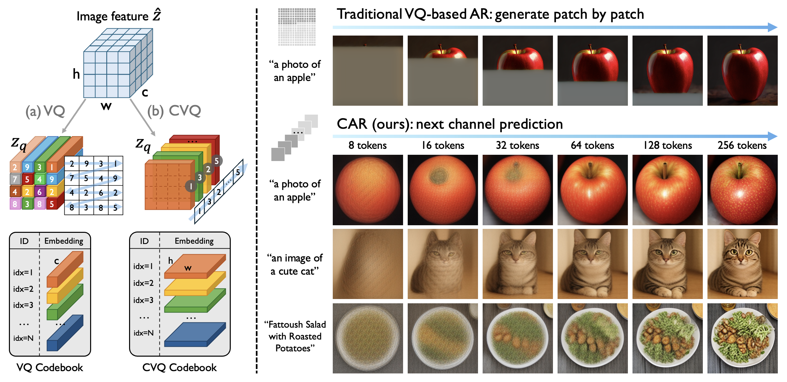
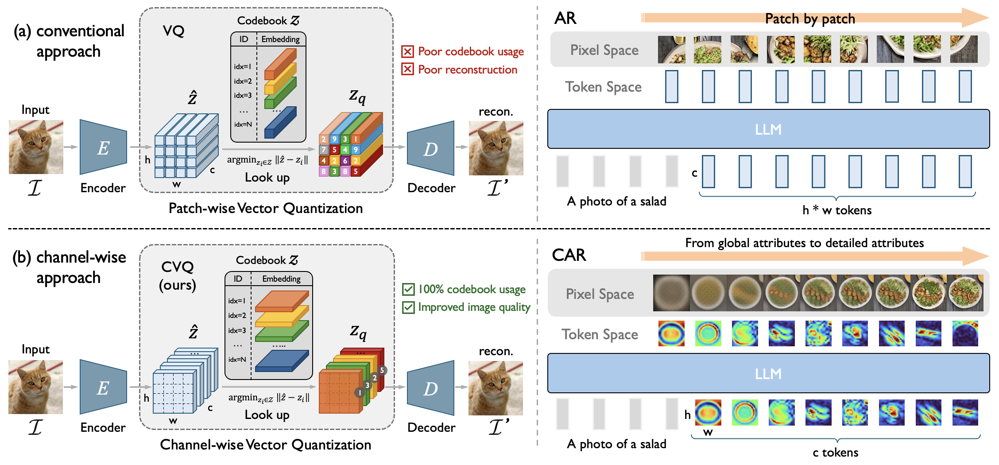

<h2 align="center"> <a href="https://arxiv.org/abs/2605.26089">Channel-wise Vector Quantization</a></h2>
<h5 align="center"> If our project helps you, please give us a star ⭐ and <a href="##citation">cite our paper</a>!</h2>
<h5 align="center">

<a href="https://arxiv.org/abs/2605.26089"></a>
<a href=""></a>
<a href=""></a>
</div>

<div style="display: flex; justify-content: center;">  
    
</div>


## 🌈 Introduction

We present Channel-wise Vector Quantization (CVQ), a novel image tokenization paradigm that replaces patch-wise tokens with channel-wise tokens. Unlike conventional vector quantization, which assigns a discrete token to each patch feature vector, CVQ quantizes each channel of the feature map. This formulation represents an image as discrete levels of visual details, rather than as a grid of spatial patches. Based on CVQ, we introduce a new visual autoregressive framework with "next-channel prediction". Instead of rendering images patch by patch in raster order, our Channel-wise Autoregressive (CAR) model predicts image channels sequentially, producing progressively enriched visual details. Specifically, it first sketches global structure and then refines fine-grained attributes, akin to a human artist's workflow. Empirically, we show that: (1) CVQ achieves 100% codebook utilization with a 16K+ codebook size without any bells and whistles, and substantially improves reconstruction quality over conventional VQ; and (2) CAR demonstrates strong effectiveness for text-to-image generation.



This repository provides a ViT version of the CVQ tokenizer. For convenience, we directly inherit the SigLIP architecture, using only its first *n* layers.

## 📰 News

- **[2025/03/18]** 🌟 We have released the technical report of **CVQ**. See [here](https://arxiv.org/abs/2605.26089)!


## 🤗 Model Zoo

> More model weights are on the way & Stay tuned! 🚀


## 🔧 Requirements and Installation

* Python ≥ 3.11
* PyTorch ≥ 2.4.1
* transformers == 4.50.3

## 🚀 Training

To train a tokenizer from scratch, run:

```bash
torchrun --nproc_per_node 8 -m main \
    --sem_weight 1 \
    --stage 1 \
    --name cvq-16k-imagenet \
    --model "model_config_256_cvq_16k_1024d" \
    --save-frequency 1 \
    --train-data="/your/path/to/ImageNet-1K-web/train_web/train-{00000..00256}.tar" \
    --train-num-samples 1281167 \
    --dataset-type "webdataset" \
    --warmup=10000 \
    --batch-size=32 \
    --lr=1e-4 \
    --beta1=0.5 \
    --beta2=0.9 \
    --wd=0.0001 \
    --epochs=100 \
    --gan_start_epoch=0 \
    --restart_gan=100 \
    --workers=1
```

or you can directly run the tokenizer training command:

```bash
bash run.sh
```


## Inference

```bash
python inference.py
```

## 🙇 Acknowledgement

CVQ is built upon:
[DualToken](https://github.com/mit-han-lab/vila-u),
[OpenCLIP](https://github.com/mlfoundations/open_clip),
and [VQGAN](https://github.com/compvis/taming-transformers).


## 📝 Citation

```bibtex
@article{cvq,
  title={Channel-wise Vector Quantization},
  author={Song, Wei and Wang, Tianhang and Chen, Yitong and Zhang, Tong and Wu, Zuxuan and Li, Ming and Wang, Jiaqi and Yu, Kaicheng},
  journal={arXiv preprint arXiv:2605.26089},
  year={2026}
}
```


## LICENSE

This project is licensed under the MIT License - see the [LICENSE](LICENSE) file for details.
